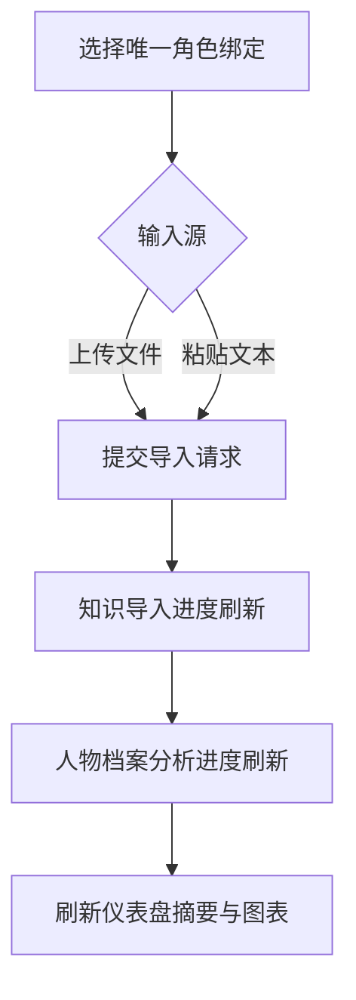

# 知识导入 / 人物档案 / 仪表盘闭环设计

## 0. 术语约定

| 术语 | 定义 | 防冲突结论 |
|---|---|---|
| 知识导入工作台 | 后台里统一承载“上传文件 + 粘贴文本 + 启动导入 + 查看进度”的单一入口 | 现有代码里只有知识导入面板样式片段，还没有明确的“工作台”概念；本 feature 新增该术语，避免继续把文件导入和文本粘贴拆成两个平行入口 |
| 导入任务 | 一次用户主动触发的知识处理过程，输入可以来自文件或粘贴文本，输出是处理后的知识结果与进度状态 | 区别于已有 `imports` 配置记录；`imports` 更偏已导入记录，导入任务更偏运行中/刚完成的执行态 |
| 人物档案分析任务 | 依据真实新增聊天内容更新人物档案的运行时分析过程 | 对齐 `src/participant-profile-runtime.js` 里“仅允许依据新增消息总结”的现有语义，不把它扩大成自由知识抽取 |
| 绑定确认 | 在导入或分析前，明确当前操作落到哪个角色/预设/作用域 | 区别于已有后端 `binding` 解析结果；这里强调的是 UI 可见的操作前确认，而不是底层 resolution 算法 |
| 仪表盘卡片 | 仪表盘中表达某类运行状态的可视化区块，可包含统计值、趋势线、占比图和最近任务摘要 | 对齐现有 `#dashboard` 布局，但把“列表堆信息”收敛成可理解的图表卡片，不引入新的管理后台概念 |

术语 grep 结论：

- 已存在且必须复用的概念：`binding`、`participant profile`、`dashboard`、`knowledge import progress`、`participant profile progress`
- 本次不新造“知识库容器”“画像容器”等额外概念，避免和记忆系统、角色管理混淆
- “人物档案”严格沿用现有中文说法，不改成 persona/profile book 等其他叫法

## 1. 决策与约束

### 1.1 需求摘要

为后台操作者提供一条可直观看懂的主线：

1. 先在一个显眼入口里完成角色绑定确认
2. 在同一区域选择“上传文件”或“粘贴文本”作为知识输入
3. 启动导入后立即看到转换进度
4. 同时可看到人物档案分析进度与最近结果摘要
5. 在仪表盘中用图表和统计卡片观察调用量、人物档案容量、最近导入/分析状态
6. 能基于全局 API 和库里唯一角色做一条端到端闭环验证

目标用户：当前项目维护者/后台操作者。

成功标准：

- 用户不用在多个零散区域来回找入口，就能完成一次导入或粘贴导入
- 每次导入和人物档案分析都有清晰的进行中/完成/失败状态
- 仪表盘不再只是信息堆叠，至少能直观看到调用趋势和人物档案容量表达
- 绑定目标在操作前可见，避免“导入到了哪一个角色/作用域”不清楚
- 变量页不再停留在 `rawValue` 原始文本框，至少能把角色卡初始变量和运行时变量按来源、结构和作用域展示出来
- 可以对唯一角色跑完一次全链路测试并留下测试约束
- 聊天实战链路会额外校对耗时与回复完整性，避免后台链路“看起来很快但结果不完整”

### 1.2 明确不做什么

- 不在这次 feature 内重写后端知识处理算法，只整合现有入口、进度状态和展示闭环
- 不新增第三方图表库，优先用现有前端能力和原生 SVG / CSS 表达
- 不把人物档案扩展成独立知识库系统，仍然只基于真实聊天增量分析
- 登录/认证在当前 feature 推进期允许临时关闭或绕过，但只作为联调阻塞解除措施，完工前必须恢复并补做验收
- 不在这次 feature 内追求完整 SillyTavern UI 对齐
- 不同时改聊天运行时核心语义；已有 `chat-backend-runtime` 设计仍保持独立推进

### 1.3 关键决策

1. **把文件导入和粘贴文本并到同一块知识导入工作台里，而不是保留两个分散入口。**
   - 原因：用户当前最强反馈就是“导入按钮不明显”“粘贴也要和导入做到一块”。
   - 取舍：保留两种输入形态，但收敛到同一操作流。

2. **进度展示优先复用已有后端 progress 能力，而不是另起一套任务系统。**
   - 代码依据：`src/routes.js` 已注入 `updateKnowledgeImportProgress`、`getParticipantProfileProgress`、`getKnowledgeImportProgress`。
   - 取舍：先把现有状态显化到 UI；若字段不够，再做最小补口。

3. **人物档案展示按“分析任务 + 最近结果摘要”接入，不做新的人物档案编辑器。**
   - 原因：当前主诉是“人物档案那里也要做”“进度要显示”，不是要求重做 profile 编辑系统。
   - 代码依据：`src/participant-profile-runtime.js` 已明确增量分析语义。

4. **仪表盘使用卡片 + 简单图形表达，不引入新依赖，并支持低扰动的动态刷新。**
   - 原因：AGENTS.md 明确禁止擅自引入新第三方依赖；当前需求重点在可理解性与持续可观测性，不在复杂图表能力。
   - 取舍：优先使用分层轮询 + 页面可见性控制；不在本次 feature 内引入 websocket 或新的实时通道。

5. **后台 UI 视觉升级以“高级控制台”风格为目标，但只复用现有前端能力与原生 CSS / SVG。**
   - 原因：用户明确要求 UI 不能继续停留在“功能能用但观感简陋”的层级。
   - 参考方向：吸收 GitHub 上常见现代 dashboard 的信息层级、深浅面板、弱发光边框、紧凑统计卡和大图表区布局，但不照搬第三方模板代码。

6. **全链路测试锁定库里的唯一角色。**
   - 原因：用户已明确要求“先给我绑定库里的唯一角色进行导入测试，api 用全局的那个，然后进行全链路测试”。
   - 取舍：设计阶段先把测试闭环写死，实装时按现有角色扫描结果执行。

8. **变量页按“结构化变量控制台”升级，而不是继续停留在 `rawValue` 文本框 CRUD。**
   - 原因：用户明确要求变量页要联动 QQ-Tavern / SillyTavern 角色卡变量，且有些变量有初始值、聊天过程中还会继续更新；仅保留原始 JSON 文本框不利于观察和操作。
   - 代码依据：`public/index.html` 当前变量页已有 `/api/memory/variables` list/detail/save 流程，但展示仍以 `rawValue` 预览与 textarea 编辑为核心；`src/character.js` 已存在 `extractSillyTavernMetadata(...)`，可作为角色卡变量来源锚点。
   - 取舍：本次优先做“来源识别 + 结构展示 + 人类可读编辑”，不重写变量存储模型；仍复用现有 `valueType` / `rawValue` / scope 字段。

9. **聊天实战链路必须补一条“耗时 + 完整性”双维度验证，而不是只看接口是否秒回。**
   - 原因：用户已明确反馈同一模型在 SillyTavern 里要接近 1 分钟才能完整回答，而当前项目几秒就结束，存在提前结束、后处理缺失、流式拼接异常或测试路径不一致的风险。
   - 取舍：本次先把测试入口和验收口径写进设计，后续实现阶段沿现有全局 API 与聊天运行时做最小必要排查，不先改聊天核心语义。

### 1.4 被拒方案

- **方案 A：只补一个更显眼的上传按钮，不动粘贴入口和进度流。**
  - 拒绝原因：只能解决“按钮不明显”，解决不了“导入、粘贴、进度、人物档案”闭环断裂。

- **方案 B：先单独重做仪表盘，导入和人物档案以后再说。**
  - 拒绝原因：会偏离当前高关注主线，且仪表盘数据来源仍然不清晰。

- **方案 C：接入第三方图表库一次性做完整运营看板。**
  - 拒绝原因：超出最小必要修改，也违反当前“优先复用现有依赖”的约束。

- **方案 D：为仪表盘单独引入实时订阅 / websocket 通道。**
  - 拒绝原因：当前项目没有必要为了后台观测先扩一整套实时基础设施；优先用可控轮询把动态刷新闭环补齐。

- **方案 E：直接套用 GitHub 上现成后台模板的完整代码和样式体系。**
  - 拒绝原因：会把当前 feature 变成大规模 UI 重构，且容易引入不必要依赖与风格割裂；本次只吸收布局和视觉语言，不搬整套模板。

### 1.5 主流程概述

正常路径：

1. 用户进入后台，在知识导入工作台先看到当前绑定目标
2. 选择上传文件或粘贴文本
3. 点击开始导入
4. UI 进入高频轮询，优先刷新知识导入与人物档案进度
5. 导入完成或状态稳定后，仪表盘切回低频刷新，持续更新最近任务、调用趋势和人物档案容量
6. 页面处于后台标签页、面板折叠或用户手动暂停刷新时，自动降频或暂停动态刷新
7. 用户可通过最近刷新时间与手动刷新按钮确认数据不是静态快照

关键异常/边界：

- 未选择可用角色或绑定信息缺失时，不允许直接开始导入
- 上传文件为空、粘贴文本为空时，后端返回明确错误
- 任务处理中页面刷新后，前端能重新拉取当前进度，不要求任务丢失重建
- 人物档案未启用或暂无结果时，仪表盘展示“未启用/暂无数据”，而不是空白块
- 动态刷新失败时保留上一帧数据，并展示“刷新失败，可稍后重试/手动刷新”而不是清空图表
- 同一页面内避免多路重复轮询；导入进度轮询与仪表盘概览刷新要统一由页面级调度管理

## 2. 接口契约

### 2.1 后端 API：统一知识导入入口

```json
POST /api/knowledge/import
{
  "characterName": "库里唯一角色名",
  "presetName": null,
  "source": {
    "type": "text",
    "text": "这里是粘贴的原始文本"
  }
}
=>
{
  "ok": true,
  "job": {
    "type": "knowledge-import",
    "status": "running",
    "characterName": "库里唯一角色名",
    "progress": {
      "phase": "processing",
      "percent": 35,
      "message": "正在解析与清洗文本"
    }
  }
}
// 来源：src/routes.js 现有知识导入 / progress 能力，knowledge import 工作台新增统一入口
```

主要错误路径：

```json
POST /api/knowledge/import
{
  "characterName": "",
  "source": {
    "type": "text",
    "text": ""
  }
}
=>
{
  "ok": false,
  "error": "缺少有效的角色绑定或知识输入"
}
// 来源：src/routes.js 现有 normalizeKnowledgeCharacterInput / normalizeKnowledgeScopeInput 模式，新增统一校验口
```

说明：

- 文件上传和粘贴文本都收敛到该入口语义下；实现上允许保留 `multipart/form-data` 子路径，但对前端暴露统一任务返回结构
- 返回值必须包含当前绑定目标和可显示的进度摘要，避免 UI 再自行拼装

### 2.2 后端 API：统一进度快照入口

```json
GET /api/runtime/progress?characterName=库里唯一角色名
=>
{
  "ok": true,
  "binding": {
    "characterName": "库里唯一角色名",
    "presetName": null,
    "scopeType": "user_persistent",
    "scopeKey": "default"
  },
  "knowledgeImport": {
    "status": "running",
    "phase": "processing",
    "percent": 35,
    "message": "正在解析与清洗文本",
    "updatedAt": "2026-04-20T10:00:00.000Z"
  },
  "participantProfile": {
    "status": "running",
    "phase": "analyzing",
    "percent": 60,
    "message": "正在根据新增消息更新人物档案",
    "updatedAt": "2026-04-20T10:00:10.000Z"
  }
}
// 来源：src/routes.js 中 getKnowledgeImportProgress / getParticipantProfileProgress / getBindingSummary
```

主要错误路径：

```json
GET /api/runtime/progress?characterName=不存在的角色
=>
{
  "ok": false,
  "error": "角色不存在或未绑定"
}
// 来源：src/routes.js 绑定摘要语义，新增统一聚合查询
```

### 2.3 后端 API：仪表盘摘要入口

```json
GET /api/dashboard/overview?characterName=库里唯一角色名
=>
{
  "ok": true,
  "meta": {
    "refreshMode": "polling",
    "recommendedIntervalMs": 15000,
    "lastUpdatedAt": "2026-04-20T10:02:00.000Z"
  },
  "stats": {
    "requestCount24h": 128,
    "knowledgeImports7d": 6,
    "participantProfiles": {
      "total": 1,
      "updated24h": 1,
      "entries": [
        {
          "characterName": "库里唯一角色名",
          "stableLength": 1260,
          "stateLength": 420,
          "updatedAt": "2026-04-20T10:02:00.000Z"
        }
      ]
    }
  },
  "charts": {
    "requestTrend": [12, 18, 9, 22, 16, 30, 21],
    "profileCapacity": [
      { "label": "稳定画像", "value": 1260 },
      { "label": "当前状态", "value": 420 }
    ]
  },
  "recentJobs": [
    {
      "type": "knowledge-import",
      "status": "completed",
      "characterName": "库里唯一角色名",
      "updatedAt": "2026-04-20T10:01:00.000Z"
    }
  ]
}
// 来源：public/index.html #dashboard 布局、src/routes.js getActiveMemoryInfo 及现有观测型接口模式
```

说明：

- `requestTrend` 用于折线表达调用量
- `profileCapacity` 用于扇形/占比表达人物档案容量构成
- `meta.recommendedIntervalMs` 由后端给出建议刷新节奏，前端可在活跃任务期间主动降到更高频，但不能自行无限加快
- 若暂无数据，字段仍返回空数组或 0，不让前端猜结构

主要错误路径：

```json
GET /api/dashboard/overview?characterName=不存在的角色
=>
{
  "ok": false,
  "error": "角色不存在或无法生成仪表盘摘要"
}
// 来源：仪表盘聚合查询新增错误口径
```

### 2.4 前端组件契约

#### 组件拆分

- `KnowledgeImportWorkbench`
  - 父级：知识管理/导入所在面板
  - 职责：统一承载角色绑定确认、文件上传、文本粘贴、导入按钮、导入进度、人物档案进度
- `ImportBindingSummary`
  - 子级：展示当前角色/预设/作用域绑定摘要
- `ImportSourceSwitcher`
  - 子级：在“上传文件”和“粘贴文本”之间切换
- `RuntimeProgressCard`
  - 子级：展示知识导入和人物档案两类进度卡
- `DashboardOverviewCards`
  - 父级：仪表盘顶部统计卡
- `DashboardCharts`
  - 父级：仪表盘图表区，负责折线/扇形等轻量图形渲染
- `DashboardRefreshController`
  - 页面级：统一调度高频进度轮询、低频仪表盘刷新、页面可见性降频与手动刷新
- `VariableConsolePanel`
  - 父级：变量页面主容器，负责来源切换、结构视图切换、详情编辑与保存
- `VariableSourceSummary`
  - 子级：展示变量来源（角色卡初始值 / 运行时更新 / 手工写入）、绑定角色/预设/作用域与最后更新时间
- `StructuredVariableViewer`
  - 子级：按标量 / 对象 / 数组把 `rawValue` 解析成条目视图或树形视图，并保留原始值回退入口
- `ChatRuntimeProbePanel`
  - 父级：用于执行聊天全链路对照测试，展示请求开始时间、首 token 时间、结束时间、最终文本长度与完整性校对结果

拆分理由：把“输入源选择”“绑定展示”“进度展示”“仪表盘图表”“刷新调度”从单一大面板中拆开，避免继续把所有交互堆进 `public/index.html` 的一坨脚本分支里；变量页和聊天探针也按“只补最小必要控制台能力”的方式拆出独立面板，避免把结构化变量展示和聊天验收逻辑硬塞进现有表单。

#### Props / 事件示例

```js
<KnowledgeImportWorkbench
  binding={{ characterName: '库里唯一角色名', presetName: null, scopeType: 'user_persistent', scopeKey: 'default' }}
  knowledgeProgress={{ status: 'running', percent: 35, message: '正在解析与清洗文本' }}
  participantProfileProgress={{ status: 'idle', percent: 0, message: '等待开始' }}
  dashboardMeta={{ refreshMode: 'polling', recommendedIntervalMs: 15000, lastUpdatedAt: '2026-04-20T10:02:00.000Z' }}
  onSubmitImport={submitKnowledgeImport}
  onRefreshProgress={fetchRuntimeProgress}
  onRefreshDashboard={fetchDashboardOverview}
/>
// 来源：public/index.html 导入面板区域；src/routes.js getBindingSummary + progress 能力
```

```js
<DashboardRefreshController
  runtimeIntervalMs={2500}
  dashboardIntervalMs={15000}
  pauseWhenHidden={true}
  onTickRuntime={fetchRuntimeProgress}
  onTickDashboard={fetchDashboardOverview}
  onManualRefresh={refreshAllPanels}
/>
// 约束：运行中任务优先刷新 runtime，dashboard 走低频；页面 hidden 时自动降频或暂停
// 来源：本 feature 新增页面级刷新调度契约
```

```js
onSubmitImport({
  sourceType: 'file',
  file,
  text: '',
  characterName: '库里唯一角色名'
})
// 约束：file 与 text 二选一，且至少有一个有效输入
// 来源：知识导入工作台新增组件契约
```

#### 变量页结构化视图契约

```js
<VariableConsolePanel
  binding={{ characterName: '库里唯一角色名', presetName: null, scopeType: 'user_persistent', scopeKey: 'default' }}
  sourceSummary={{ source: 'character-card', hasRuntimeUpdates: true, updatedAt: '2026-04-20T10:03:00.000Z' }}
  variableItem={{
    key: 'mood_state',
    valueType: 'json',
    rawValue: '{"affection":72,"flags":["trusted","curious"]}'
  }}
  viewMode="tree"
  onToggleViewMode={setVariableViewMode}
  onSave={saveVariable}
/>
// 约束：默认优先展示结构化结果；只有解析失败或用户主动切换时才回退到 rawValue 文本框
// 来源：public/index.html 当前变量页 save/list/detail 流程 + 本 feature 新增结构化展示契约
```

```js
<StructuredVariableViewer
  valueType="json"
  rawValue='{"affection":72,"flags":["trusted","curious"]}'
  fallbackText="原始值"
  modes={['list', 'tree', 'raw']}
/>
// 约束：标量显示单行条目；对象按 key/value 展示；数组显示可展开子项；解析失败时展示错误提示并保留 raw 模式
```

#### 聊天全链路探针契约

```js
<ChatRuntimeProbePanel
  binding={{ characterName: '库里唯一角色名', presetName: null }}
  requestMeta={{ provider: 'global-api', scenario: 'sillytavern-parity-check' }}
  metrics={{ startedAt: '2026-04-20T10:05:00.000Z', firstTokenAt: '2026-04-20T10:05:03.000Z', completedAt: '2026-04-20T10:05:42.000Z', finalLength: 1860 }}
  completeness={{ status: 'pending', note: '等待与 SillyTavern 实战结果比对' }}
  onRunProbe={runChatRuntimeProbe}
/>
// 约束：不只记录接口耗时，还要记录首 token / 完成时间 / 最终长度 / 完整性结论，避免把“秒回”误判为正常
```


- 页面级状态：当前绑定摘要、最近一次导入任务、最近一次人物档案任务、仪表盘摘要、最后刷新时间、刷新模式（高频/低频/暂停）、变量结构视图模式、聊天探针最近一次测量结果
- 组件内部状态：导入源 tab、文本输入框内容、上传文件名、局部 loading、变量树展开态、聊天探针当前步骤
- 不新增全局 store；当前阶段维持页面脚本内集中状态管理

#### 视觉与布局约束

- 导入工作台提升到页面首屏的主操作区，使用更厚的卡片边框、分层背景、明确主按钮，避免继续像附属表单块
- 统计卡采用“主数字 + 次级趋势/说明 + 弱发光边界”的高级控制台风格，避免纯表格化堆叠
- 图表区遵循“大图表 + 次级摘要列”布局，折线图占主要视觉中心，容量占比与最近任务放在右侧信息列
- 变量页采用“来源摘要 + 结构视图 + 原始值回退”的三段式布局，默认先给人类可读结构，不默认把 textarea 顶在最前面
- 聊天探针区展示关键时间点、文本长度与完整性判定，避免只给出一个泛化的“耗时多少秒”
- 颜色控制在深色中性底 + 1~2 个高亮强调色，避免把后台做成花哨运营看板
- 保留原生 CSS / SVG 可实现范围，不引入外部设计系统或整套模板样式
- GitHub 参考只用于吸收卡片层次、间距、信息密度和图表布局，不直接复制仓库代码

#### 关键交互路径

1. 用户切换到“粘贴文本”
2. `ImportSourceSwitcher` 切换输入态并保留未提交文本
3. 用户点击“开始导入”
4. 页面触发统一导入 API
5. `DashboardRefreshController` 把 runtime 轮询切到高频模式，并驱动 `RuntimeProgressCard` 刷新
6. 任务完成后，页面把 dashboard 切回低频刷新，同时更新最近刷新时间与最近任务摘要
7. 用户可随时点手动刷新，强制同步导入工作台与仪表盘

### 2.5 主流程图



## 3. 实现提示

### 3.1 改动计划

- 前端：整理现有导入区域，收敛成一个显眼的知识导入工作台
- 前端：把文件上传和文本粘贴合并进同一操作流
- 前端：补上知识导入进度 + 人物档案进度双卡片
- 前端：加入页面级刷新调度，统一管理进度高频轮询与仪表盘低频动态刷新
- 前端：重组仪表盘，把关键统计和图表放到更直观、更有层次的高级控制台布局中
- 前端：升级变量页面，补来源摘要、结构化 list/tree 视图与 rawValue 回退编辑
- 前端：加入聊天全链路探针面板，展示耗时、长度和完整性校验结果
- 前端：基于现有 CSS / SVG 提升卡片、图表、主操作区的视觉质感
- 后端：提供统一的导入任务入口、进度聚合入口、仪表盘摘要入口
- 后端：在现有变量接口之上补充角色卡变量来源摘要与运行时更新标记所需字段
- 测试：补接口测试、动态刷新验证、变量结构展示验证和唯一角色全链路验证

### 3.2 实现风险与约束

- `public/index.html` 已经承载大量样式和脚本，本次改动容易继续把逻辑堆大；实现时优先抽出内聚函数，避免在单个事件处理器里塞分支
- 导入进度与人物档案进度可能来自不同后端函数，聚合时必须保持字段稳定，前端不应再做多套兼容判断
- 变量页结构化展示依赖对 `rawValue` 的安全解析；必须区分“可解析 JSON”“普通字符串”“解析失败但需要保留原值”三种路径，不能为了树形展示破坏原始存储
- 角色卡初始变量与运行时变量更新可能同时存在；展示时必须保留来源标记与最后更新时间，避免用户误判当前值来自角色卡还是聊天过程
- 聊天延迟排查必须保证测试路径和 SillyTavern 实战路径尽量对齐，否则会把“入口不同”误诊成“运行时异常”
- 人物档案分析必须继续遵守 `src/participant-profile-runtime.js` 的语义：仅基于真实新增消息，不臆测
- 动态刷新必须有明确的启停和降频策略，避免因为后台面板常驻而产生无意义高频请求
- UI 升级只允许在现有技术栈内完成，禁止为了“更高级”临时引入新依赖或整套模板
- UI 改动属于 AGENTS.md 重点验证范围，实装后必须浏览器人工验证导入入口、粘贴入口、进度展示、动态刷新和仪表盘图表理解性

### 3.3 推进顺序

1. **整理统一导入工作台的静态结构与绑定摘要展示，并先完成首屏视觉升级骨架**
   - 退出信号：页面上已存在单一显眼入口，能同时看到绑定摘要、文件上传和文本粘贴切换，且主操作区具备明确层级

2. **接入统一导入提交逻辑与知识导入进度刷新**
   - 退出信号：上传文件和粘贴文本都能触发同一条导入任务流，并显示知识导入进度

3. **接入人物档案进度、页面级刷新调度与最近结果摘要**
   - 退出信号：导入完成后可看到人物档案分析状态、最近更新时间和摘要占位/结果，且刷新模式能在高频/低频之间切换

4. **重组仪表盘统计卡片、轻量图表表达与动态刷新反馈**
   - 退出信号：仪表盘可直观看到调用趋势、人物档案容量构成、最近任务状态，并可见最后刷新时间/手动刷新反馈

5. **升级变量页为结构化变量控制台，并接入角色卡变量来源摘要**
   - 退出信号：变量页默认可以把标量 / 对象 / 数组渲染成条目或树形视图，能看到来源、作用域和更新时间，且 rawValue 只作为回退编辑入口

6. **补后端聚合接口、聊天探针与端到端测试闭环**
   - 退出信号：全局 API 能返回统一结构，变量来源摘要与聊天探针指标可稳定获取，且基于唯一角色的导入链路与聊天链路验证可跑通

### 3.4 测试设计

#### 功能点 1：统一导入入口

- 验证方式：接口测试 + 浏览器手工验证
- 关键用例骨架：
  - 文本导入时返回 running/progress 结构
  - 文件导入时返回 running/progress 结构
  - 缺少角色或缺少输入时返回明确错误

#### 功能点 2：进度聚合展示

- 验证方式：接口测试
- 关键用例骨架：
  - `GET /api/runtime/progress` 同时返回 knowledgeImport 与 participantProfile
  - 未启用人物档案时返回稳定的空态结构而不是缺字段

#### 功能点 3：仪表盘摘要与动态图表数据

- 验证方式：接口测试 + 浏览器手工验证
- 关键用例骨架：
  - `GET /api/dashboard/overview` 在无数据时返回空数组/0 和稳定 `meta`
  - 有数据时返回调用趋势、档案容量结构与最近任务
  - 前端能把返回值渲染成可理解图形，不出现空白卡片
  - 页面处于活跃导入期时能按高低频策略自动刷新，而不是只加载一次

#### 功能点 4：视觉升级与可操作性

- 验证方式：浏览器手工验证
- 关键用例骨架：
  - 导入工作台在首屏具有显著主入口，不再像次级表单
  - 统计卡、图表区、最近任务区具备清晰层级和一致风格
  - 手动刷新、最近刷新时间、刷新失败提示都可见且不打断已有数据展示

#### 功能点 5：变量页结构化展示与角色卡联动

- 验证方式：接口测试 + 浏览器手工验证
- 关键用例骨架：
  - 变量列表能展示角色卡初始变量、运行时更新变量和手工写入变量的来源摘要
  - `valueType=json` 且 `rawValue` 可解析时，前端默认渲染条目视图或树形视图，而不是直接落到 textarea
  - `rawValue` 解析失败时，页面展示错误提示但保留原始值编辑入口，不吞掉数据
  - 标量 / 对象 / 数组三类值在结构视图下都能保持稳定展示

#### 功能点 6：唯一角色全链路测试

- 验证方式：最小化 mock 的集成测试 / 手工闭环
- 关键用例骨架：
  - 绑定库里唯一角色
  - 通过全局 API 提交一次文本导入
  - 轮询直到导入完成
  - 检查人物档案进度/结果摘要可读
  - 检查仪表盘摘要同步反映最近任务与最新刷新时间
  - 检查变量页能看到与该角色绑定的结构化变量和来源摘要

#### 功能点 7：聊天延迟与完整性对照验证

- 验证方式：最小化 mock 的集成测试 / 手工对照验证
- 关键用例骨架：
  - 使用与 SillyTavern 实战尽量一致的角色、预设和全局 API 路径发起一次聊天请求
  - 记录开始时间、首 token 时间、完成时间与最终文本长度
  - 对照 SillyTavern 实战结果检查是否存在明显的提前结束、后处理缺失或回复截断
  - 当后台链路耗时显著更短时，仍需通过完整性校对后才能判定为正常

## 4. 与项目级架构文档的关系

- 关联架构文档：`easysdd/architecture/DESIGN.md`
- 关联已有 feature：`easysdd/features/2026-04-12-chat-backend-runtime/chat-backend-runtime-design.md`
- 关系说明：
  - 本 feature 不替代 `chat-backend-runtime`，而是把当前已存在的运行时能力组织成后台可操作、可观测、可验证的闭环 UI 与聚合 API
  - 实现完成后，应在 `easysdd/architecture/DESIGN.md` 的“后台可观测性”或“角色生命周期/世界书/提示词运行时”相关段落补一条引用，说明后台已形成“导入工作台 + 进度聚合 + 仪表盘观测”的操作闭环
  - 同步应修正 `easysdd/architecture/DESIGN.md` 中“当前项目根目录还没有 AGENTS.md”的过时描述
